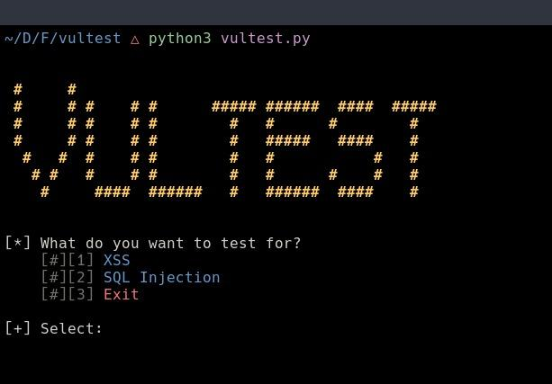

<h1 align="center"> 🕷Vultest 🕷</h1>

 <h2 align="center"> Automatic Web Vulnerability Scanner</h2>

Vultest is a terminal-based web vulnerability scanner written in **Python**.
It is a script that crawls and tests a given URL against well-known vulnerabilities.
## Screenshots



## Main Features

- Reflected XSS scanning
- Blind XSS find
- SQL injection scanning
- Crawling all links on a website
- POST and GET forms are supported

## OS support

- Linux
- Windows
- MacOS

## Tools

- Python
- [Python Poetry](https://realpython.com/dependency-management-python-poetry/)
- Shell environment
- Git

## Getting started

You must have python installed in the OS of choice.
Then run:
```bash
$ git clone https://github.com/xtasysensei/vultest.git
$ cd vultest
$ poetry install
```
### Python environment

A better alternative is to create a python environment in the cloned directory and install the dependencies there.
Follow the python official documentation on virtual environments [here](https://docs.python.org/3/library/venv.html)

## Usage
Run:
```bash
$ poetry shell
$ poetry run python vultest.py
```

Follow the prompt that comes up.
